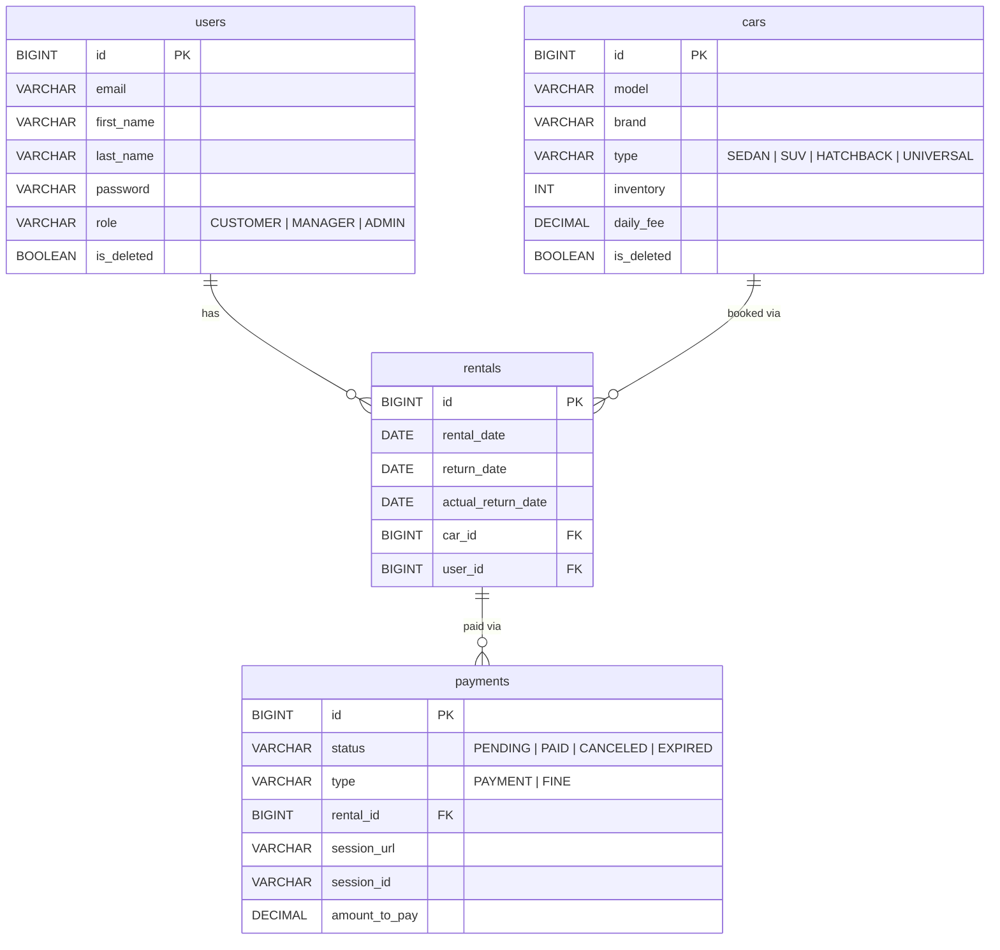

# 🚗 Car Sharing Service API

A production-ready RESTful backend for a car sharing platform built with Java and Spring Boot.  
The application handles the full rental lifecycle — from user registration and car browsing through rental creation, payment processing via Stripe, and automated overdue notifications via Telegram.

---

## 🚀 Features

- RESTful API architecture
- JWT-based authentication & authorization
- Role-based access control (CUSTOMER / MANAGER / ADMIN)
- Full car rental lifecycle management
- Stripe payment integration (checkout sessions, webhooks)
- Soft delete for cars and users
- Automated overdue rental detection (scheduled job)
- Telegram bot notifications for rentals, payments, and overdue alerts
- Swagger / OpenAPI documentation
- Liquibase database migrations
- Comprehensive unit and integration tests with Testcontainers

---

## 🛠️ Technologies Used

### Backend
- Java 17
- Spring Boot 3.3.4
- Spring Web
- Spring Security
- Spring Data JPA
- Hibernate
- Maven

### Database
- MySQL 8.0
- Liquibase (migrations)

### Payments & Notifications
- Stripe Java SDK 32.0.0
- Telegram Bots API 9.2.1

### Documentation & Tools
- Swagger / OpenAPI (springdoc 2.6.0)
- MapStruct 1.6.3
- Lombok
- JWT (jjwt 0.11.5)
- Postman
- Git & GitHub

### Testing
- JUnit 5
- Mockito 5.18.0
- MockMvc
- Testcontainers (MySQL)
- Spring Security Test

---

## 📂 Project Structure

```text
src
 ┣ main
 ┃ ┣ java
 ┃ ┃ ┗ com.car.sharing.app
 ┃ ┃    ┣ controller        # REST controllers (auth, car, rental, payment, user)
 ┃ ┃    ┣ service           # Business logic layer
 ┃ ┃    ┣ repository        # Spring Data JPA repositories
 ┃ ┃    ┣ entity            # JPA entities (Car, Rental, Payment, User)
 ┃ ┃    ┣ dto               # Request / Response DTOs
 ┃ ┃    ┣ mapper            # MapStruct mappers
 ┃ ┃    ┣ security          # JWT filter, UserDetailsService, JwtUtil
 ┃ ┃    ┣ exception         # Global exception handler, custom exceptions
 ┃ ┃    └ validation        # Custom validators (e.g. @FieldMatch)
 ┃ ┗ resources
 ┃    ┣ application.properties
 ┃    └ db/changelog        # Liquibase migration scripts
 ┗ test
    ┣ java
    ┃ ┗ com.car.sharing.app
    ┃    ┣ controller        # Integration tests (MockMvc + Testcontainers)
    ┃    ┣ repository        # Repository tests (@DataJpaTest + Testcontainers)
    ┃    ┣ service           # Unit tests (Mockito)
    ┃    ┣ config            # CustomMySQLContainer (singleton Testcontainers)
    ┃    └ util              # TestUtil, TestConstants
    └ resources
       ┣ application-test.properties
       └ db
          ┣ cleanup          # SQL truncate scripts (run before each test)
          └ setup            # SQL seed scripts (insert test data)
```

---

## 🏗️ Architecture

The application follows a standard layered architecture:

```
Client
  │
  ▼
Controller  ──►  Service  ──►  Repository  ──►  MySQL DB
               │
               ├──► StripeService       (payment sessions)
               ├──► NotificationService (Telegram alerts)
               └──► ScheduledJob        (overdue check @ 10:00 daily)
```

---

## 🗂️ Data Model



> `users` and `cars` use soft delete — deleted records are excluded from all queries automatically via Hibernate's `@SQLRestriction("is_deleted = false")`.

---

## 🔐 Security

Authentication and authorization are handled by **Spring Security** with **JWT tokens**.

| Role | Permissions |
|---|---|
| `CUSTOMER` | Register, login, browse cars, create/view rentals, make payments, manage own profile |
| `MANAGER` | All CUSTOMER views (any user), manage car inventory |
| `ADMIN` | Update user roles |

Security features include:

- BCrypt password encoding
- JWT stateless authentication filter
- Role-based endpoint protection via `@PreAuthorize`
- Soft delete on users (deactivated accounts excluded from all queries via `@SQLRestriction`)

---

## 💳 Payment Flow

```
CUSTOMER creates rental
        │
        ▼
  POST /payments  ──►  Stripe Checkout Session created
        │
        ▼
  Customer pays on Stripe
        │
        ├──► Stripe webhook → POST /webhook
        │         │
        │         ├── checkout.session.completed → status: PAID
        │         └── checkout.session.expired   → status: EXPIRED
        │
        └──► Manual success/cancel callbacks
                  ├── GET /payments/success → status: PAID
                  └── GET /payments/cancel  → status: CANCELED
```

---

## 📖 API Documentation

Swagger UI is available after starting the application:

```
http://localhost:8088/swagger-ui/index.html
```

### Endpoint overview

| Method | Path | Role | Description |
|---|---|---|---|
| POST | `/auth/registration` | Public | Register new user |
| POST | `/auth/login` | Public | Login and receive JWT |
| GET | `/cars` | Authenticated | List all cars |
| GET | `/cars/{id}` | Authenticated | Get car by id |
| POST | `/cars` | MANAGER | Create car |
| PATCH | `/cars/{id}` | MANAGER | Update car |
| PATCH | `/cars/{id}/inventory` | MANAGER | Update inventory |
| DELETE | `/cars/{id}` | MANAGER | Soft delete car |
| POST | `/rentals` | CUSTOMER | Create rental |
| GET | `/rentals` | CUSTOMER / MANAGER | List rentals |
| GET | `/rentals/{id}` | CUSTOMER / MANAGER | Get rental by id |
| POST | `/rentals/{id}/return` | CUSTOMER / MANAGER | Set return date |
| GET | `/payments` | CUSTOMER / MANAGER | List payments |
| POST | `/payments` | CUSTOMER | Create payment |
| GET | `/payments/success` | Public (Stripe) | Handle success callback |
| GET | `/payments/cancel` | Public (Stripe) | Handle cancel callback |
| GET | `/users/me` | CUSTOMER | Get own profile |
| PATCH | `/users/me` | CUSTOMER | Update own profile |
| PUT | `/users/{id}/role` | ADMIN | Update user role |

---

## ⚙️ Getting Started

### Prerequisites

- Java 17+
- Maven 3.8+
- MySQL 8.0
- Stripe account (for payment features)
- Telegram bot token (for notifications)

### 1. Clone the repository

```bash
git clone https://github.com/your-username/car-sharing-app.git
cd car-sharing-app
```

### 2. Configure the application

Open `src/main/resources/application.properties` and configure:

```properties
# Database
spring.datasource.url=jdbc:mysql://localhost:3306/car_sharing_db
spring.datasource.username=your_username
spring.datasource.password=your_password

# JWT
jwt.secret=your_jwt_secret
jwt.expiration=86400000

# Stripe
stripe.secret.key=sk_test_your_stripe_key
stripe.webhook.secret=whsec_your_webhook_secret

# Telegram
telegram.bot.api=your_telegram_bot_token
telegram.user.id=your_telegram_chat_id
```

### 3. Build the project

```bash
mvn clean install
```

### 4. Run the application

```bash
mvn spring-boot:run
```

Or run the generated JAR:

```bash
java -jar target/car-sharing-app.jar
```

The application will start on `http://localhost:8088`.

---

## 🐳 Running with Docker

### 1. Build the JAR

```bash
mvn clean package
```

### 2. Build Docker image

```bash
docker build -t car-sharing-app .
```

### 3. Run with Docker Compose

```bash
docker-compose up
```

### 4. Stop containers

```bash
docker-compose down
```

---

## 🧪 Running Tests

Run all tests:

```bash
mvn test
```

The test suite includes:

- **Repository tests** — `@DataJpaTest` + MySQL Testcontainers, verifying custom queries and soft-delete behavior
- **Service unit tests** — pure Mockito, no Spring context, fast feedback
- **Controller integration tests** — `@SpringBootTest` + `MockMvc` + MySQL Testcontainers, hitting real endpoints with SQL fixtures

> Tests require Docker to be running locally (for Testcontainers to spin up MySQL).

---

## 📬 Postman Collection

A ready-to-use Postman collection is included for testing all endpoints.

1. Open Postman
2. Click **Import**
3. Select `/postman/car-sharing-collection.json`
4. Run the application locally
5. Start with `POST /auth/registration`, then `POST /auth/login`
6. Copy the returned JWT and set it in the Postman environment:

```
token = your_jwt_token_here
```

All secured requests will automatically use:

```
Authorization: Bearer {{token}}
```

---

## 🧩 Challenges & Lessons Learned

Building this project involved several non-trivial backend engineering challenges:

- Implementing Stripe webhook signature verification and idempotent payment status updates
- Testing services that depend on Stripe's static SDK methods using `mockStatic()`
- Handling soft-delete with `@SQLDelete` + `@SQLRestriction` across JPA relationships
- Using `@WithUserDetails` instead of `@WithMockUser` for controllers that inject the real `User` entity via `@AuthenticationPrincipal`
- Managing Testcontainers lifecycle efficiently with a singleton MySQL container shared across all test classes
- Writing stable integration tests with SQL fixture ordering to satisfy FK constraints

---

## 📸 Possible Improvements

- Redis caching for frequently accessed car listings
- OAuth2 / Google login
- Email notifications as an alternative to Telegram
- Refresh token support
- CI/CD pipeline with GitHub Actions
- Kubernetes deployment configuration
- Rate limiting on payment endpoints

---

## 📄 License

This project is licensed under the MIT License.